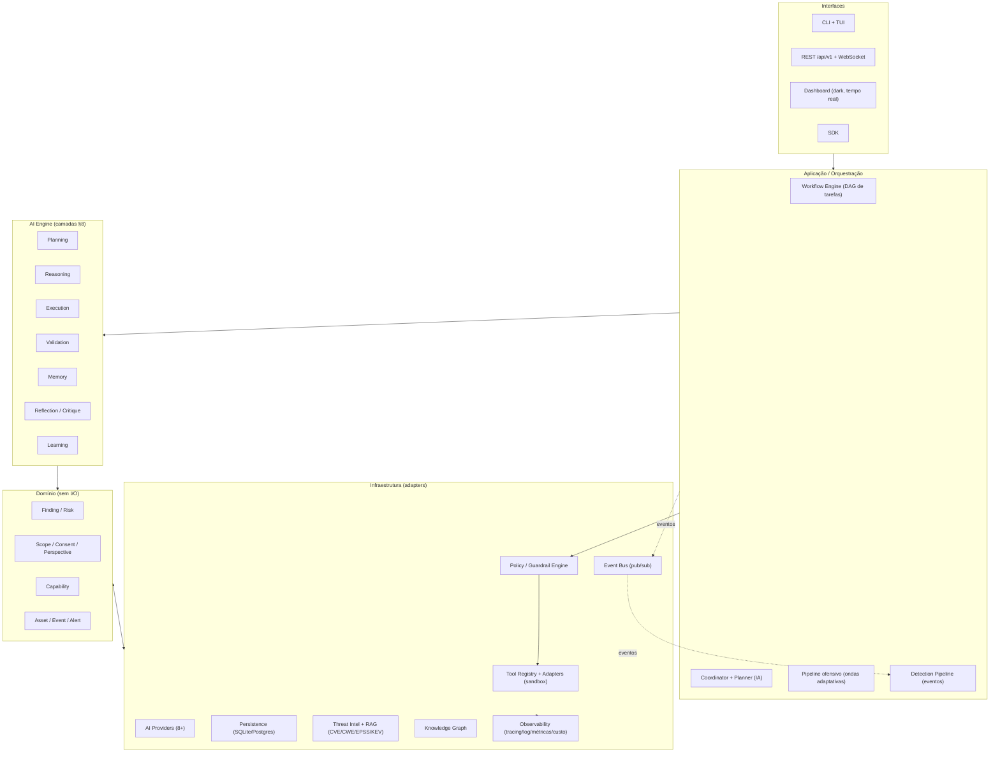
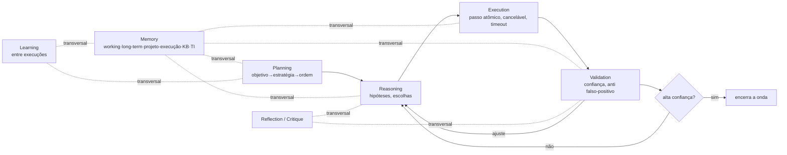
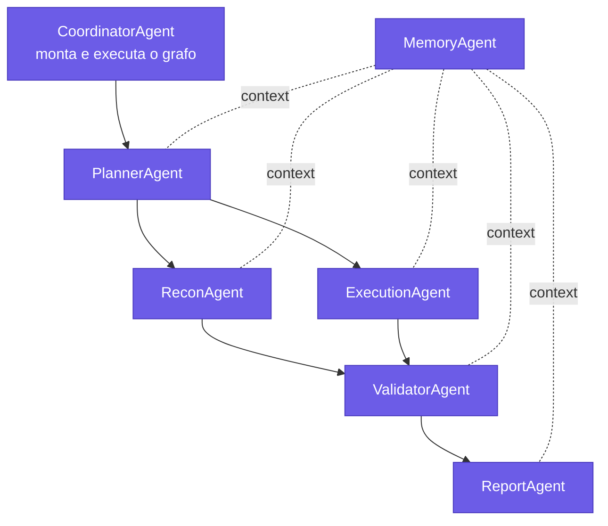
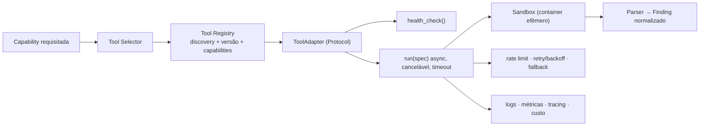
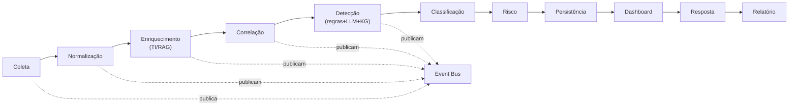
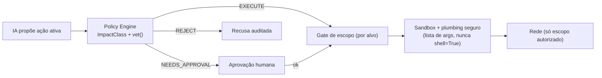

# TARGET_ARCHITECTURE — Arquitetura‑alvo do EIGAN (Fase 0)

> **Propósito.** Descrever *para onde* o EIGAN vai sob o MASTER PROMPT v2: de
> "agente de pentest AI‑native" para **plataforma AI‑Native de Security
> Operations**, com identidade própria. Este documento é o **norte**; a
> `GAP_ANALYSIS.md` diz o que falta e em que ordem construir.
>
> **Regras que moldam o alvo** (herdadas do `CLAUDE.md` e do MASTER PROMPT):
> anti‑invenção/veracidade (§2/§3.1), autorização/escopo sempre, IA obrigatória,
> secure‑by‑default, **anti over‑engineering** (padrões só onde reduzem custo real),
> **plugin‑first** (Core pequeno), evolução incremental com portões.
>
> **Referências conceituais** (só o *porquê*, nunca código): **Strix** (orquestração
> multi‑agente por grafo, sandbox, PoC) e **Wazuh** (operações defensivas em escala:
> pipeline de eventos, agente de endpoint, rule engine). Inspiração registrada em
> ADR; implementação 100 % original (§3 do MASTER PROMPT).

---

## 1. Princípio organizador

O EIGAN‑alvo é um **AI Security Operating System**: um monólito **modular** (não
microserviços por default) onde a IA raciocina em camadas separadas e testáveis,
o Core é pequeno e estável, e **toda funcionalidade nova nasce como plugin**.
Duas colunas de valor sobre um mesmo substrato:

- **Ofensiva (pentest‑first)** — a coluna primária, já madura hoje.
- **Defensiva (detection/SOC)** — pipeline de eventos, correlação, resposta.

Ambas alimentam e são alimentadas por: **Threat Intelligence + RAG**, **Knowledge
Graph**, **Asset/Attack‑Surface Management**, **Compliance** e **Observabilidade**.

---

## 2. Visão macro (camadas)

**Regra de dependência:** setas apontam para dentro; o **Domínio não conhece
infraestrutura**. Interfaces e adapters são substituíveis sem tocar o domínio.

---

## 3. AI Engine — camadas separadas (MASTER PROMPT §8), nunca um agente monolítico

Cada camada tem **contrato próprio e mockável** nos testes das outras. O EIGAN
já tem **Planning/Execution/Validation‑parcial** (no `engine/cognitive/`); o alvo
formaliza **Reasoning/Reflection/Learning** e uma **Memory** persistente entre runs.

---

## 4. Multi‑agente — grafo de agentes cooperativos (§11)

**Contrato base de todo agente:** `plan(context)→Plan` · `execute(step)→Result`
(cancelável, com timeout) · `validate(result)→Verdict` · `reflect(history)→Adjustment`;
publica ciclo de vida no **event bus** (`agent.started/step/finding/done/error`) —
**nunca** chamada direta acoplada entre agentes.

**Ciclo de raciocínio obrigatório (nenhum agente pula):**
`pensar → planejar → hipóteses → ordem/estratégia → executar → validar → corrigir
→ repetir → encerrar só com alta confiança`.

**Núcleo mínimo primeiro (Fase 2):** Planner · Coordinator · Recon · Execution ·
Validator · Report · Memory, rodando um scan **end‑to‑end** antes de expandir.
Expansão (um por vez, com teste): Attack Surface, OSINT, Web, API, Network, Cloud,
Container, K8s, AD, Exploit, Detection, SOC, Correlation, Reviewer, Self‑Critic,
Reflection, Learning.

---

## 5. Tool Registry + Adapters (§12)

Contrato: `name·version·capabilities·health_check()→Health·run(spec)→RunResult`.
**Uma ferramenta é implementação intercambiável de uma Capability** — trocar a
ferramenta amanhã não quebra nada acima da camada de plugin (invariante já vivo hoje).

---

## 6. Pipeline defensivo — eventos (§13, conceito Wazuh · código original)

Cada estágio **publica eventos** e é **plugável**. Rule engine moderno = regras
declarativas + LLM + (ML só quando justificar) + knowledge graph + threat intel.
Decoders/regras **versionados**, com prioridade, severidade, mapeamento MITRE e IOC.

---

## 7. Threat Intelligence + RAG (§15) e Knowledge Graph

Enriquecimento **automático** de cada finding: CVE · CWE · CAPEC · CPE · IOC ·
MITRE ATT&CK · EPSS · KEV · ExploitDB · referências · remediação — **sempre de
fonte oficial, jamais fabricado** (§2). **RAG sobre CVE/CWE** para consulta/
contexto do agente. O **Knowledge Graph** liga ativos ↔ serviços ↔ vulnerabilidades
↔ técnicas ATT&CK ↔ controles de compliance, permitindo *attack paths* e priorização.

---

## 8. Workflow Engine por grafo (§17)

DAG de tarefas com **dependências, execução paralela, cancelamento, retry, circuit
breaker e estado retomável**. Agentes são **nós**; o Coordinator monta o grafo a
partir do plano da IA. Substitui a fila linear atual onde paralelismo/dependência
explícitos agregarem valor — **sem** transformar tudo em grafo prematuramente
(anti over‑engineering §4.4).

---

## 9. Persistência e modelo de dados (§18)

Entidades: **Assets/Hosts · Eventos · Vulnerabilidades/Findings · Alertas ·
Configurações · Regras · Agentes · Execuções**. Repositórios **atrás de interfaces**
(trocar SQLite↔Postgres sem tocar domínio — já é assim para findings). Índices,
busca, histórico entre execuções, **retenção** configurável.

---

## 10. Observabilidade desde o dia 1 (§22) — lacuna atual prioritária

Tracing distribuído · logging estruturado · métricas · health · **token usage ·
custo de execução · tempo de execução**. Nasce **com** cada módulo novo, não como
retrofit. É a lacuna transversal mais barata de começar e a que mais destrava
governança de custo da IA.

---

## 11. Segurança da própria plataforma (§23) — envelope inviolável

**A IA propõe; a política dispõe.** Grounding + gate de escopo + redaction de
secrets/PII + sandbox real cercam a autonomia. Zero Trust · Least Privilege ·
Defense in Depth · Secure by Default · Privacy by Design. **Nunca** segredo em código.

---

## 12. Dashboard & interfaces (§19)

Dashboard dark, tempo real via WebSocket: Attack Surface · Assets · Timeline de
raciocínio · MITRE Matrix · Attack Graph/Kill Chain · Compliance · Risk Score ·
Threat Intel · AI Insights · Findings · Live Scan · agentes/ferramentas ativos ·
eventos · **token usage/custo** · saúde da plataforma · histórico. Zero regra de
negócio no frontend (tudo de `/api/v1`).

---

## 13. Estrutura de diretórios‑alvo (adaptada ao repo real)

O alvo **não** exige renomear a árvore atual de `src/eigan/`. Os módulos‑alvo do
MASTER PROMPT §9/§10 mapeiam para a estrutura existente, crescendo por adição:

| Módulo‑alvo (MASTER PROMPT) | Onde vive/viverá no EIGAN |
|---|---|
| `core` (contratos/portas) | `capability.py`, `perspective.py`, `findings/schema.py`, protocols em `engine/` |
| `ai_engine` (planning/reasoning/execution/validation/memory/reflection/learning) | `engine/cognitive/` (evolui: +reasoning/reflection/learning/memory) |
| `agents` | `engine/cognitive/agent.py` → pacote por agente |
| `tools` (registry+adapters) | `engine/registry.py` + `plugins/**` |
| `event_bus` | **novo** sobre `engine/events.py` |
| `workflow` (DAG) | **novo** `engine/workflow/` |
| `detection` | `engine/blue.py` + **novo** pipeline de eventos |
| `threat_intel` (+RAG) | `engine/feeds.py`/`risk.py` → **novo** `threat_intel/` + RAG |
| `compliance` | `analysis/compliance.py` |
| `asset_mgmt` / `attack_surface` | `analysis/inventory.py` + **novo** |
| `knowledge_graph` | **novo** `knowledge_graph/` |
| `persistence` | `findings/store.py` (Repository) → generaliza |
| `observability` | `logging_setup.py` → **novo** `observability/` (tracing/custo) |
| `plugin_system` | `engine/plugin.py`, `registry.py` (já existe) |
| `api` / `cli` / `sdk` / `dashboard` | `api/`, `cli/`, **novo** `sdk/`, `api/static/` |

---

## 14. Divergência declarada vs. `CLAUDE.md` atual (rastreabilidade §3 do CLAUDE.md)

O MASTER PROMPT v2 **estende** o `CLAUDE.md` atual e, em alguns pontos, **diverge**
— o que é permitido desde que registrado (regra do próprio `CLAUDE.md`):

1. **Escopo do produto:** de "scanner AI‑native Web+Infra" → "plataforma de
   Security Operations" (coluna defensiva de *eventos*, endpoint agent, KG, RAG).
2. **`CLAUDE.md`:** o MASTER PROMPT §30 pede **reescrever** o `CLAUDE.md` do zero
   como constituição única. → **Fase 7**, não agora (evita perder as linhas
   vermelhas atuais durante a transição).
3. **Módulos novos** (event bus, workflow DAG, knowledge graph, observabilidade de
   custo, endpoint agent) não existem no `CLAUDE.md` atual. → entram por ADR.

Nenhuma divergência afrouxa as **linhas vermelhas**: autorização/escopo, secure
coding, redaction, grounding/anti‑invenção, IA obrigatória. Estas permanecem
inegociáveis no alvo.
